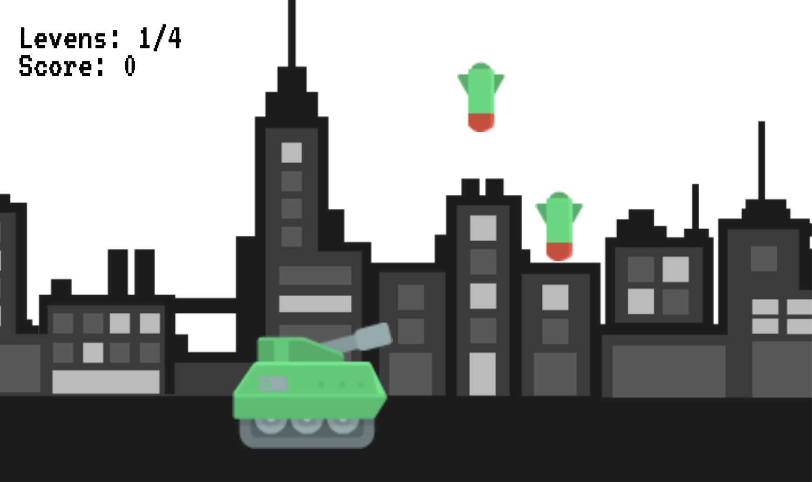

# Programmeren 4 - Toets Atom bombs - Opdracht A



In deze toets ga je het zelf bedachte spel Atom bombs uitwerken. 

## Checklist voor uploaden
- Let op de deadline
- Uploaden op [Cumlaude](https://lms.hr.nl)
- Plaat de foto van het klassendiagram in de hoofdmap
- Vul het verantwoordingsdocument volledig in volgens de eisen van de beoordelingscriteria
- Maak een zip-bestand van de hoofdmap. Zet in de bestandsnaam van de zip je naam

## Spelregels

Jij gaat met jouw tank de stad redden! Vang met de tank de bommen die uit de lucht komen op.

De tank kun je van links naar rechts bewegen met toetsen op het toetsenbord. De bommen komen vanaf een random plek van boven naar beneden gestort. Zodra je een bom aanraakt met de tank, verdwijnt de bom en ontvang je punten. Zodra je een bom niet op tijd kunt opvangen en de grond raakt, verlies je 1 van jouw 4 levens.

Als er geen levens meer over zijn is het game over. Dit wordt getoond in een game over element.

## Voorwaarden

### Bom
- De bommen worden op een random plek geplaatst boven je scherm en gaan met een vaste snelheid van 2 naar beneden.

**Code om een DOM element op een random x- en y-positie te zetten:**
```
/**
* Get random number between a minimum and maximum
* @param min 
* @param max 
*/
private getRandom(min: number, max: number): number{
    return Math.floor(Math.random() * (max - min + 1)) + min;
}

/**
* Set current x parameter to a random position on the x-axis
* @param element 
*/
private setRandomXInScreen(element : HTMLElement): void {
    let min = 0;
    let max = window.innerWidth - element.clientWidth;

    this.x = this.getRandom(min, max);
}

/**
* Set current y parameter to a random position above the screen
*/
private setRandomYAboveScreen(): void {
    let min = 0 - 500;
    let max = 0;

    this.y = this.getRandom(min, max);
}
```

### Tank
- De tank kan van links, naar rechts bewegen met de 'a'- en 'd'-toets van een toetsenbord met een snelheid van 5 of -5.
- De tank kan niet buiten het scherm komen.

**Code om een DOM element, zoals de tank, om te draaien:**
```
/**
* Add a style transform to flip an element horizontally
* You can only use one transform command on one element
* @param element 
*/
private flipElement(element : HTMLElement){
    let existingTransform = element.style.transform;
    element.style.transform = existingTransform + " scaleX(-1)";
}
```